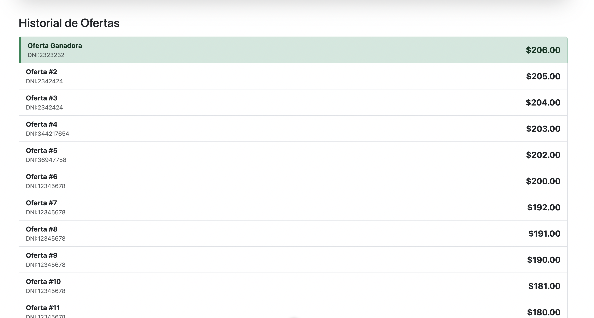
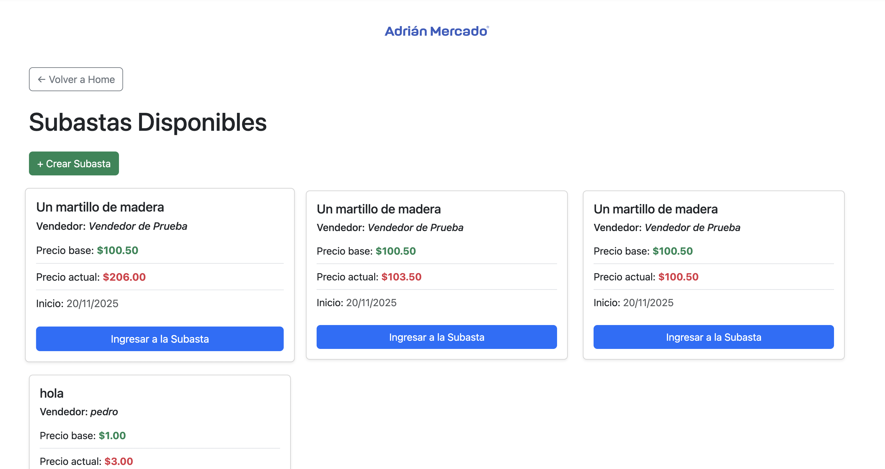
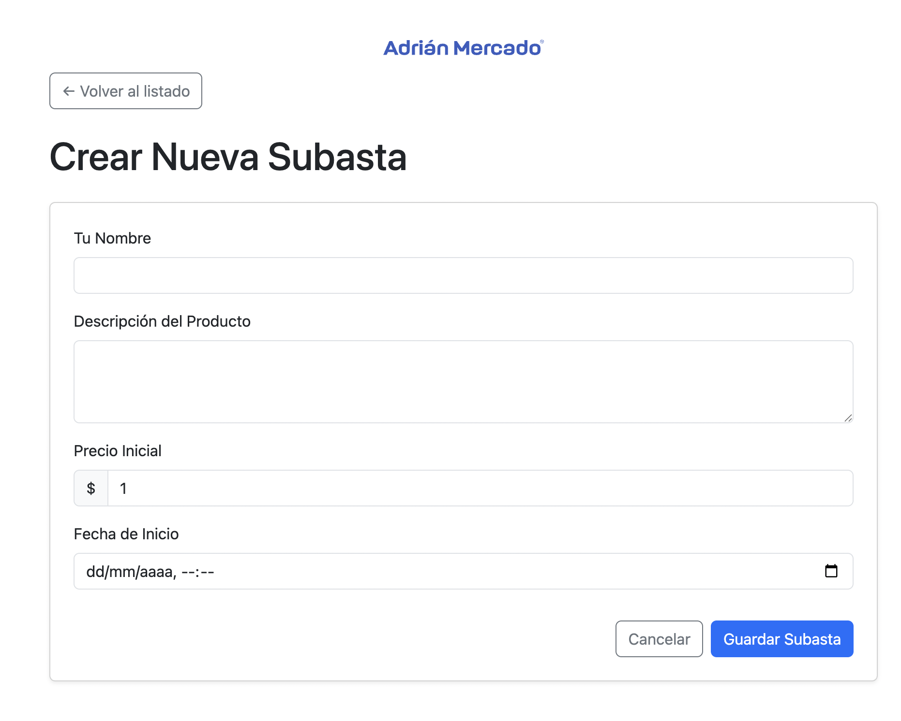
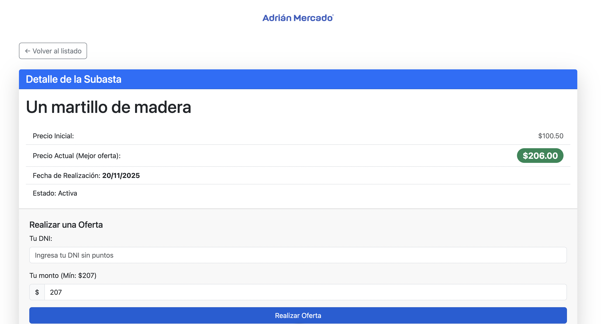

# 🏷️ Sistema de Subastas (Laravel + Vue)

Este repositorio contiene una aplicación completa de **subastas en tiempo real**, organizada como un _monorepo_ con dos proyectos independientes:

- **/backend** → API desarrollada en **Laravel 11+**, usando _Sail_, _Reverb_ (WebSockets) y _Queues_.
- **/frontend** → SPA desarrollada en **Vue 3 + Vite**.

---

## 🏗️ Estructura del Proyecto

```
/
├── backend/   # Proyecto Laravel (API)
├── frontend/  # Proyecto Vue.js (Cliente)
└── README.md  # Este archivo
```

---

## 🛠️ Prerrequisitos

Asegurate de tener instaladas las siguientes herramientas:

- **Docker Desktop** → necesario para Laravel Sail
- **Node.js 18+** y **npm** → requerido por Vite
- **Composer** → para instalar dependencias de PHP

---

## 🏁 Instalación Inicial

Si es la primera vez que clonás el repositorio, seguí estos pasos.

---

# 1️⃣ Backend (Laravel + Sail)

### 1. Entrar a la carpeta del backend

```bash
cd backend
```

### 2. Instalar dependencias de Composer

```bash
composer install
```

### 3. Crear archivo de entorno

(Configurá la base de datos y las claves de Reverb.)

```bash
cp .env.example .env
```

### 4. Levantar los contenedores con Sail

```bash
./vendor/bin/sail up -d
```

### 5. Generar clave de la app

```bash
./vendor/bin/sail artisan key:generate
```

### 6. Ejecutar migraciones

```bash
./vendor/bin/sail artisan migrate
```

---

# 2️⃣ Frontend (Vue + Vite)

### 1. En una **nueva terminal**, entrar al frontend

```bash
cd frontend
```

### 2. Instalar dependencias de Node

```bash
npm install
```

### 3. (Opcional) Configurar variables de entorno del frontend

Ejemplo:

```
VITE_API_URL=http://localhost:8000
```

---

## 🚀 Levantar el Entorno de Desarrollo

Para ejecutar el sistema completo (incluyendo tiempo real), necesitás **4 terminales abiertas**.

---

### 🟦 Terminal 1 — Servicios de Sail (Web + DB + Redis)

```bash
cd backend
./vendor/bin/sail up -d
```

---

### 🟩 Terminal 2 — Servidor de WebSockets (Reverb)

```bash
cd backend
./vendor/bin/sail artisan reverb:start
```

---

### 🟧 Terminal 3 — Worker de Colas

```bash
cd backend
./vendor/bin/sail artisan queue:work
```

---

### 🟨 Terminal 4 — Frontend (Vite)

```bash
cd frontend
npm run dev
```

---

## 📌 Accesos

| Servicio        | URL                                            |
| --------------- | ---------------------------------------------- |
| Frontend (Vite) | [http://localhost:5173](http://localhost:5173) |
| Backend (API)   | [http://localhost:8000](http://localhost:8000) |

> La URL del backend dependerá de `APP_URL` en tu `.env` de Sail.

---

## 🛑 Detener Servicios

Para bajar todos los contenedores del backend:

```bash
cd backend
./vendor/bin/sail down
```





